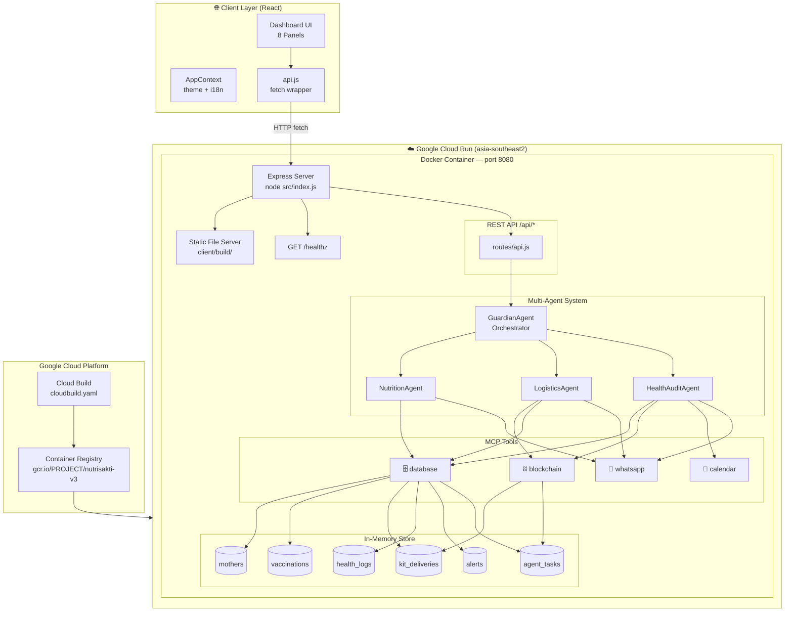
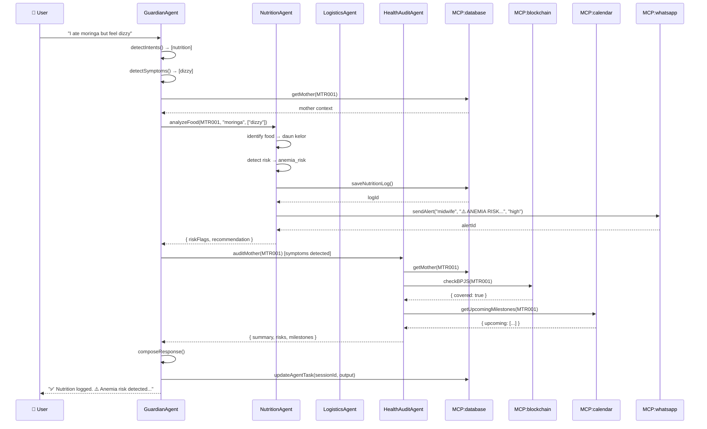
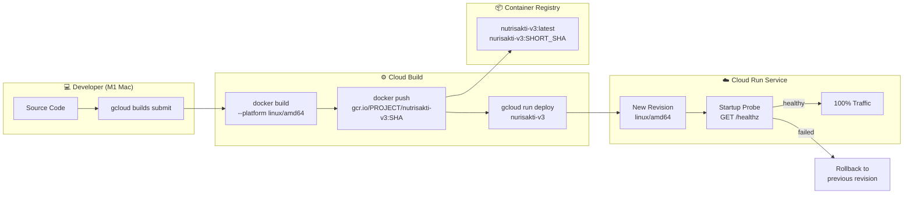
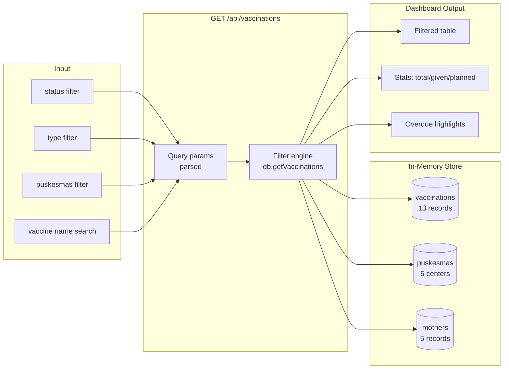
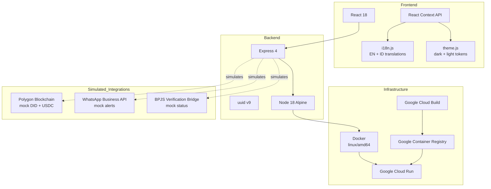

# NutriSakti v3 — Architecture Diagram

## 1. System Architecture Overview



---

## 2. Multi-Agent Coordination



---

## 3. Deployment Pipeline



---

## 4. Data Flow — Vaccination Calendar



---

## 5. Container Internal Structure

```
/app
├── server/
│   ├── package.json
│   ├── node_modules/          ← installed at build time
│   └── src/
│       ├── index.js           ← Express entry, serves /app/client/build
│       ├── routes/
│       │   └── api.js         ← all REST endpoints
│       ├── agents/
│       │   ├── guardianAgent.js
│       │   ├── nutritionAgent.js
│       │   ├── logisticsAgent.js
│       │   └── healthAuditAgent.js
│       ├── tools/
│       │   └── mcpTools.js    ← calendar, database, blockchain, whatsapp
│       └── db/
│           └── database.js    ← in-memory store + mock data
└── client/
    └── build/                 ← React production build (copied from stage 1)
        ├── index.html
        └── static/
            └── js/main.*.js   ← 55KB gzipped
```

---

## 6. Technology Stack


