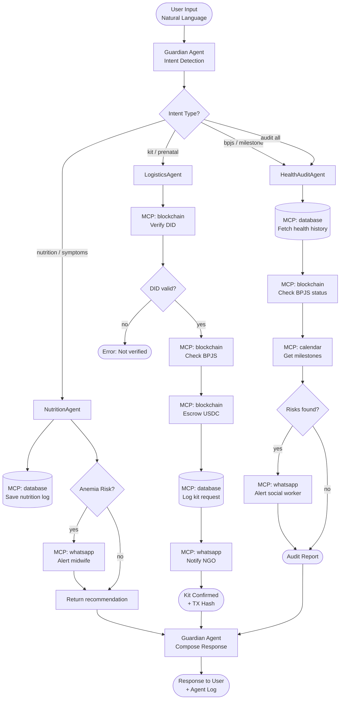
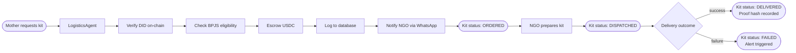
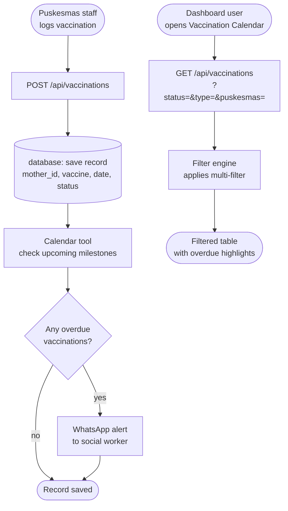
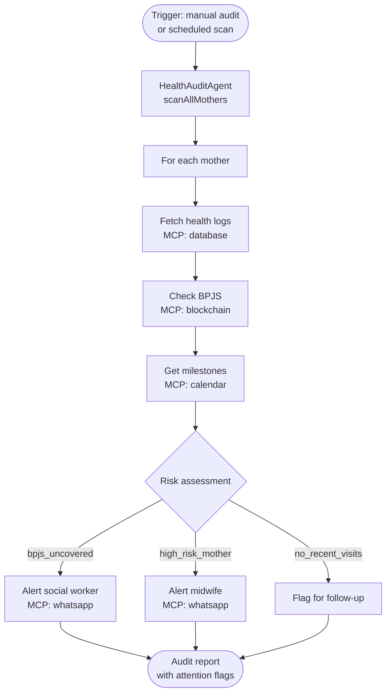

# NutriSakti v3 — Process Flow Diagram

## 1. Main System Flow

```mermaid
flowchart TD
    A([User Input\nNatural Language]) --> B[Guardian Agent\nIntent Detection]

    B --> C{Intent Type?}

    C -->|nutrition / symptoms| D[NutritionAgent]
    C -->|kit / prenatal| E[LogisticsAgent]
    C -->|bpjs / milestone| F[HealthAuditAgent]
    C -->|audit all| F

    D --> D1[(MCP: database\nSave nutrition log)]
    D --> D2{Anemia Risk?}
    D2 -->|yes| D3[MCP: whatsapp\nAlert midwife]
    D2 -->|no| D4[Return recommendation]
    D3 --> D4

    E --> E1[MCP: blockchain\nVerify DID]
    E1 --> E2{DID valid?}
    E2 -->|no| E3([Error: Not verified])
    E2 -->|yes| E4[MCP: blockchain\nCheck BPJS]
    E4 --> E5[MCP: blockchain\nEscrow USDC]
    E5 --> E6[(MCP: database\nLog kit request)]
    E6 --> E7[MCP: whatsapp\nNotify NGO]
    E7 --> E8([Kit Confirmed\n+ TX Hash])

    F --> F1[(MCP: database\nFetch health history)]
    F1 --> F2[MCP: blockchain\nCheck BPJS status]
    F2 --> F3[MCP: calendar\nGet milestones]
    F3 --> F4{Risks found?}
    F4 -->|yes| F5[MCP: whatsapp\nAlert social worker]
    F4 -->|no| F6([Audit Report])
    F5 --> F6

    D4 --> G[Guardian Agent\nCompose Response]
    E8 --> G
    F6 --> G
    G --> H([Response to User\n+ Agent Log])
```

## 2. Kit Delivery Flow

```mermaid
flowchart LR
    A([Mother requests kit]) --> B[LogisticsAgent]
    B --> C[Verify DID on-chain]
    C --> D[Check BPJS eligibility]
    D --> E[Escrow USDC]
    E --> F[Log to database]
    F --> G[Notify NGO via WhatsApp]
    G --> H([Kit status: ORDERED])

    H --> I[NGO prepares kit]
    I --> J([Kit status: DISPATCHED])
    J --> K{Delivery outcome}
    K -->|success| L([Kit status: DELIVERED\nProof hash recorded])
    K -->|failure| M([Kit status: FAILED\nAlert triggered])
```

## 3. Vaccination Tracking Flow

```mermaid
flowchart TD
    A([Puskesmas staff\nlogs vaccination]) --> B[POST /api/vaccinations]
    B --> C[(database: save record\nmother_id, vaccine, date, status)]
    C --> D[Calendar tool\ncheck upcoming milestones]
    D --> E{Any overdue\nvaccinations?}
    E -->|yes| F[WhatsApp alert\nto social worker]
    E -->|no| G([Record saved])
    F --> G

    H([Dashboard user\nopens Vaccination Calendar]) --> I[GET /api/vaccinations\n?status=&type=&puskesmas=]
    I --> J[Filter engine\napplies multi-filter]
    J --> K([Filtered table\nwith overdue highlights])
```

## 4. Health Audit Flow

```mermaid
flowchart TD
    A([Trigger: manual audit\nor scheduled scan]) --> B[HealthAuditAgent\nscanAllMothers]
    B --> C[For each mother]
    C --> D[Fetch health logs\nMCP: database]
    D --> E[Check BPJS\nMCP: blockchain]
    E --> F[Get milestones\nMCP: calendar]
    F --> G{Risk assessment}
    G -->|bpjs_uncovered| H[Alert social worker\nMCP: whatsapp]
    G -->|high_risk_mother| I[Alert midwife\nMCP: whatsapp]
    G -->|no_recent_visits| J[Flag for follow-up]
    H & I & J --> K([Audit report\nwith attention flags])
```
