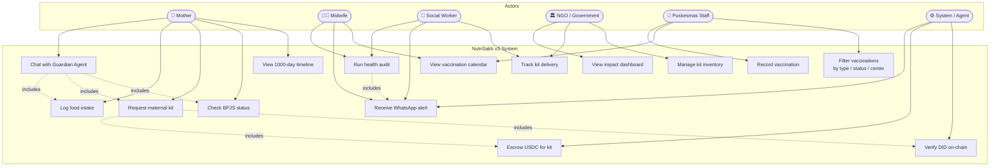
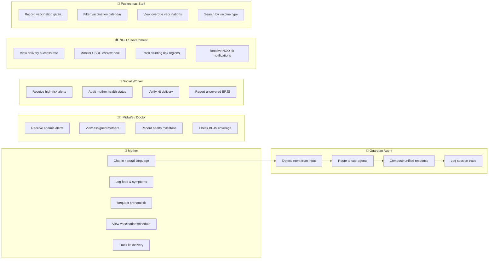

# NutriSakti v3 — Use Case Diagram

## System Actors & Use Cases

## Detailed Use Cases per Actor

## Use Case Descriptions

| ID | Actor | Use Case | Pre-condition | Post-condition |
|----|-------|----------|---------------|----------------|
| UC1 | Mother | Chat with Guardian Agent | Mother selected | Agent response + log |
| UC2 | Mother | Log food intake | Message contains food name | Nutrition saved, risk checked |
| UC3 | Mother | Request maternal kit | DID exists | USDC escrowed, NGO notified |
| UC4 | Mother | Check BPJS status | Mother ID valid | BPJS status returned |
| UC5 | Mother | View 1000-day timeline | Mother registered | Milestones displayed |
| UC6 | Puskesmas | Record vaccination | Mother + vaccine selected | Record saved |
| UC7 | Puskesmas / Midwife | View vaccination calendar | — | Filtered list shown |
| UC8 | Puskesmas | Filter vaccinations | Calendar open | Filtered results |
| UC9 | Social Worker / NGO | Track kit delivery | — | Delivery status shown |
| UC10 | Midwife / Social Worker | Run health audit | Mother ID | Risks + alerts triggered |
| UC11 | Midwife / Social Worker | Receive WhatsApp alert | Risk detected | Alert logged |
| UC12 | NGO | Manage kit inventory | — | Stock levels visible |
| UC13 | NGO / Government | View impact dashboard | — | Stats + delivery rate |
| UC14 | System | Escrow USDC | DID verified | TX hash generated |
| UC15 | System | Verify DID on-chain | Mother ID | Verified / rejected |
